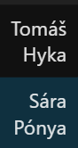
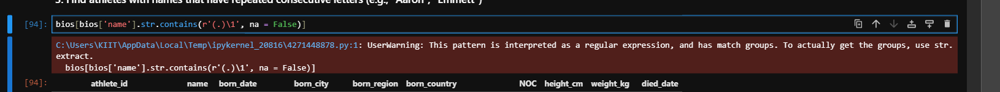
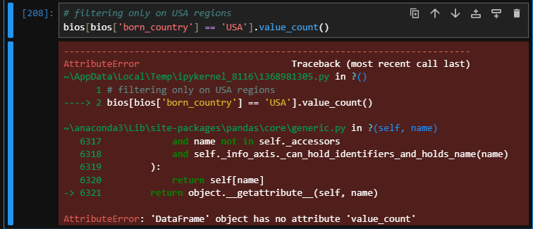
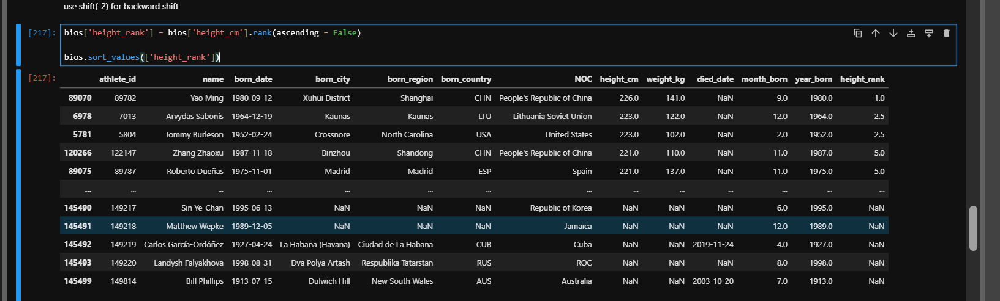

# What is a DataFrame?

A **DataFrame** is the main data structure of Python’s **pandas** library.

Think of it as a **table** with a lot of extra functionality built on top of it. It allows us to work with spreadsheets and other tabular data very easily within Python.

---

# Understanding This Filter

```python
bios[bios['born_city'].str.contains(r'^[AEIOUaeiou]', na=False)]
```

## My Question

How is this working?

* What does the **inner** `bios[...]` part produce?
* How does the **outer** `bios[...]` process it?

---

# Explanation

This code filters a pandas DataFrame named `bios` to keep only the rows where the person's `born_city` starts with a vowel.

---

## Step 1 — The Inner Part

```python
bios['born_city'].str.contains(r'^[AEIOUaeiou]', na=False)
```

This inner expression evaluates the data and creates a **boolean mask** — a Series of `True` and `False` values with the same length as the DataFrame.

### Breakdown

#### `bios['born_city']`

Selects the column containing the city names.

#### `.str`

Accesses pandas' built-in string processing methods.

#### `.contains(...)`

Tests whether each string matches a specific pattern.

#### `r'^[AEIOUaeiou]'`

This is a **Regular Expression (RegEx)**:

* `^` → means **"starts with"**
* `[AEIOUaeiou]` → means **"any one of these vowel letters"**

So this pattern checks whether the city name starts with a vowel.

#### `na=False`

Tells pandas how to handle missing values (`NaN`).

If a row has a missing or empty city value, pandas marks it as `False` instead of throwing an error.

---

## What the Inner Part Outputs

Example output:

```python
0     True
1    False
2    False
3     True
Name: born_city, dtype: bool
```

This means:

* row `0` → city starts with a vowel → `True`
* row `1` → city does not start with a vowel → `False`
* row `2` → city does not start with a vowel → `False`
* row `3` → city starts with a vowel → `True`

---

## Step 2 — The Outer Part

```python
bios[ ... ]
```

The outer `bios[...]` performs **boolean indexing** (also called **filtering**).

When a Series of `True` and `False` values is passed inside the square brackets of a DataFrame, pandas checks each row:

* if the corresponding value is `True` → **keep the row**
* if the corresponding value is `False` → **drop the row**

---

# Full Workflow

1. Pandas looks at the `born_city` column.
2. The regex checks whether each city starts with a vowel.
3. A boolean mask is generated.
4. The outer `bios[...]` uses that mask to keep only the matching rows.
5. A new filtered DataFrame is returned.

---

# Example Mental Model

Suppose:

```python
bios['born_city']
```

contains:

```python
0    Atlanta
1    Boston
2    Delhi
3    Oslo
```

Then:

```python
bios['born_city'].str.contains(r'^[AEIOUaeiou]', na=False)
```

becomes:

```python
0     True
1    False
2    False
3     True
```

Now the outer part:

```python
bios[mask]
```

keeps only rows `0` and `3`.

---

## Follow-up

How to do this **without using regular expressions**?

### Alternative Without Regex

To achieve the same result without using regular expressions, we can check the first letter of each city using normal string methods.

#### Option 1 — Using `.str.startswith()` (Recommended)

This is the cleanest alternative.

```python
# Define vowels as a tuple
vowels = ('A', 'E', 'I', 'O', 'U', 'a', 'e', 'i', 'o', 'u')
```

Then we can use `.str.startswith(vowels)` to check whether each city starts with any vowel.

#### Option 2 — Extract the First Letter with `.str[0]`

Another approach is to isolate the very first character of the string, convert it to lowercase, and then check whether it belongs to the list of vowels using `.isin()`.

```python
# 1. Get the first character, lowercase it,
#    and check if it is a vowel
vowel_mask = (
    bios['born_city']
    .str[0]
    .str.lower()
    .isin(['a', 'e', 'i', 'o', 'u'])
)

# 2. Filter the DataFrame
#    (fill NaN values with False first
#    to prevent errors)
filtered_bios = bios[vowel_mask.fillna(False)]
```

---

## Why Option 1 Is Usually Better

### Readability

`.str.startswith()` clearly says what we are trying to do:

> check whether the string starts with a vowel

---

### Speed

It is optimized in pandas for checking the beginning of strings.

---

### Safety

It handles case sensitivity neatly by simply including both uppercase and lowercase vowels in the tuple.

---

## Follow-up Possibilities

* How to measure which method is faster on your dataset
* Filter for cities ending with a vowel
* Demonstrate how to filter rows that **do not** start with a vowel

---

# Filtering Rows That Do **Not** Start with a Vowel

To filter rows that **do not** start with a vowel, we invert the boolean mask using the **tilde operator** `~`.

In pandas, `~` acts like a **NOT** operator:

* `True` becomes `False`
* `False` becomes `True`

---

### Method 1 — Inverting `.str.startswith()` (Recommended)

Place the `~` operator directly before the condition inside the outer brackets.

```python
# 1. Define the vowels tuple
vowels = (
    'A', 'E', 'I', 'O', 'U',
    'a', 'e', 'i', 'o', 'u'
)

# 2. Use ~ to say
#    "does NOT start with a vowel"
consonant_bios = bios[
    ~bios['born_city'].str.startswith(vowels, na=False)
]
```

---

### Method 2 — Inverting the Regex Pattern

If we go back to the original regex approach, the `~` is applied in the same place.

```python
consonant_bios = bios[
    ~bios['born_city'].str.contains(
        r'^[AEIOUaeiou]',
        na=False
    )
]
```

---

## How the `~` Operator Works Mechanically

Suppose the inner expression produces:

```python
[True, False, True]
```

Then applying `~` flips it to:

```python
[False, True, False]
```

Now the outer `bios[...]` keeps the rows that were originally `False`.

So if the original condition meant:

> starts with vowel

then the inverted condition means:

> does **not** start with vowel

---

## Another Follow-up

* Drop rows with missing (`NaN`) values first so they don’t skew your results
* Filter for cities that start **and** end with a vowel

---

# Dropping Rows with Missing `born_city` Values Before Filtering

To drop rows with missing (`NaN`) values in the `born_city` column before filtering, we use `.dropna()`.

This cleans the data first, so we no longer need to use `na=False` inside the filtering function.

---

### Step 1 — Drop Rows Where `born_city` Is Missing

By default, `.dropna()` returns a **new DataFrame**.

```python
# Create a cleaned DataFrame
# with no missing cities
cleaned_bios = bios.dropna(
    subset=['born_city']
)
```

#### Note

```python
subset=['born_city']
```

means:

* drop rows only if **`born_city`** is missing
* if other columns (like `birth_year`) have missing values, those rows are still kept

---

### Step 2 — Filter the Cleaned Data

Now we can filter without using `na=False`.

```python
vowels = (
    'A', 'E', 'I', 'O', 'U',
    'a', 'e', 'i', 'o', 'u'
)

# Cities starting with a vowel
starts_with_vowel = cleaned_bios[
    cleaned_bios['born_city'].str.startswith(vowels)
]

# Cities NOT starting with a vowel
no_vowel_start = cleaned_bios[
    ~cleaned_bios['born_city'].str.startswith(vowels)
]
```

---

### Tip — Overwriting the Original DataFrame

If I do not want a separate variable like `cleaned_bios`, I can overwrite the original DataFrame:

```python
bios = bios.dropna(subset=['born_city'])
```

---

### More Follow-up Options

* How to fill missing cities with a placeholder like `"Unknown"` instead of dropping them
* Check how many missing values are present in the column before dropping them

---

# Filling Missing Cities with `"Unknown"`

To fill missing values with a placeholder like `"Unknown"`, we use `.fillna()`.

This keeps every row in the dataset, so we do not lose data from other columns just because the city name is missing.

---

### Step 1 — Fill the Missing Data

Target the `born_city` column and replace `NaN` values with `"Unknown"`.

```python
# Replace NaN values in 'born_city'
# with 'Unknown'
bios['born_city'] = (
    bios['born_city']
    .fillna('Unknown')
)
```

---

### Step 2 — Run the Vowel Filter Again

Now there are no missing values, so string filters can run safely without `na=False`.

Since `"Unknown"` starts with `"U"`, it will be included in the vowel filter results.

```python
vowels = (
    'A', 'E', 'I', 'O', 'U',
    'a', 'e', 'i', 'o', 'u'
)

# Filter the DataFrame safely
starts_with_vowel = bios[
    bios['born_city'].str.startswith(vowels)
]
```

---

### Tip — Filling the Whole DataFrame at Once

To fill missing values across **all columns** in the DataFrame with `"Unknown"` (not just `born_city`), call `.fillna()` on the entire DataFrame.

```python
# Fill every NaN in the whole DataFrame with 'Unknown'
bios_fully_filled = bios.fillna('Unknown')
```

---

### Follow-up Options

* How to exclude `"Unknown"` from the final filtered results
* How to fill missing values with different placeholders based on another column
* Check how many missing values are present in the column before dropping them

---

## How to exclude "Unknown" from the final filtered results

If you filled missing cities using:

```python
bios['born_city'] = bios['born_city'].fillna('Unknown')
```

and later want only real cities that start with a vowel, then add one more condition:  
- city starts with a vowel
- city is not `"Unknown"`


```python
vowels = ('A', 'E', 'I', 'O', 'U', 'a', 'e', 'i', 'o', 'u')

starts_with_vowel_real = bios[
    bios['born_city'].str.startswith(vowels)
    &
    (bios['born_city'] != 'Unknown')
]
```

If you know "Unknown" is just a placeholder and you don’t want it to participate in filtering logic at all, then another clean option is:
* keep missing values as NaN
* use na=False while filtering

Example:

```py
starts_with_vowel = bios[
    bios['born_city'].str.startswith(vowels, na=False)
]
```

This avoids having "Unknown" behave like a real city value.

---

## Checking How Many Missing Values Exist Before Dropping Them

To check how many missing values exist in a specific column before dropping them, use:

```python
.isna().sum()
```

This combines two steps:

1. identify which values are missing
2. count how many missing values there are

---

## Step 1 — Count Missing Values in One Column

Apply the methods directly to the `born_city` column.

```python id="j8flsp"
# Count the total number of NaN values in 'born_city'
missing_count = bios['born_city'].isna().sum()

print(f"Missing cities: {missing_count}")
```

---

## Step 2 — See Missing Values for All Columns at Once

If I want a quick overview of the whole DataFrame, I can run the same methods on the entire DataFrame.

```python id="5ymjlwm"
# Show the missing-value count
# for every column
print(bios.isna().sum())
```

---

# How It Works Under the Hood

## `.isna()` / `.isnull()`

Scans the data and converts each value into:

* `True` → if the value is missing
* `False` → if the value is present

---

## `.sum()`

Treats:

* `True` as `1`
* `False` as `0`

and adds them up to give the total number of missing values.

---

## My Question

If the goal is to remove those rows anyway, then yes — adding `"Unknown"` and later excluding it creates extra work.

So why do people still do it?

Because filling missing values with `"Unknown"` can be useful in other situations.

### 1. To Prevent Errors in Later Code

Many pandas operations — such as:

* `.str.split()`
* `.str.lower()`
* custom string processing
* some transformations

can fail or behave awkwardly when they encounter `NaN`.

Replacing missing values with `"Unknown"` converts them into safe strings, which allows later code to run more smoothly.

### 2. To Keep the Row for Other Analyses

If I drop the row entirely, I lose all the other information stored in that row too.

For example, even if `born_city` is missing, the row may still contain useful data such as:

* name
* age
* occupation
* nationality
* other statistics

So filling with `"Unknown"` allows the row to stay in the dataset for future analysis.

### 3. For Cleaner Reporting and Visualization

In charts, tables, or summary reports, a category like `"Unknown"` is often easier to interpret than:

* blank values
* missing spaces
* raw `NaN` values

It makes the output cleaner and more presentation-friendly.

---

# Find Athletes with Names That Contain Exactly Two Vowels

To find athletes with names containing exactly **two vowels**, we need to count the vowels in each name string and then filter the rows where that count equals `2`.

There are multiple ways to do this.

---

# Method 1 — Using Regular Expressions (Recommended)

We can use `.str.count()` with a regex pattern that matches vowels. This automatically counts how many vowels appear in each string.

```python
# 1. Clean missing names first to prevent errors
cleaned_bios = bios.dropna(subset=['name'])

# 2. Count the vowels
#    (?i) makes the regex case-insensitive
vowel_counts = cleaned_bios['name'].str.count(r'(?i)[aeiou]')

# 3. Filter rows where the count is exactly 2
two_vowel_athletes = cleaned_bios[vowel_counts == 2]
```

---

# Method 2 — Without Regular Expressions

If regex is not desired, define a small custom function and apply it to the `name` column.

```python
# 1. Clean missing names
cleaned_bios = bios.dropna(subset=['name'])

# 2. Define a function to count vowels
def count_vowels(text):
    vowels = "aeiouAEIOU"
    return sum(1 for char in text if char in vowels)

# 3. Apply the function and filter
two_vowel_athletes = cleaned_bios[
    cleaned_bios['name'].apply(count_vowels) == 2
]
```

---

# How the Regex Pattern `(?i)[aeiou]` Works

```python
(?i)[aeiou]
```

### Breakdown

* `[aeiou]` → match any single vowel
* `(?i)` → make the match case-insensitive

So this counts both uppercase and lowercase vowels.

### Role of `.str.count()`

`.str.count()` loops through each name and returns the total number of matches found.

---

# Question — What Is This Long Regex Then?

The long regex shown in the screenshot is a **full-string pattern** used inside `.str.contains()`.

Its purpose is different from `.str.count()`:

* `.str.count()` → counts vowels and checks whether the count is `2`
* this long regex → directly matches only those names that contain exactly **two vowels** in the entire string

---

# Full Regex Version for Exactly Two Vowels

```python
two_vowels = bios[
    bios['name'].str.contains(
        r'^[^AEIOUaeiou]*[AEIOUaeiou][^AEIOUaeiou]*[AEIOUaeiou][^AEIOUaeiou]*$',
        na=False
    )
]
```

---

# How This Long Pattern Works

Pattern:

```python id="b1p6s3"
^[^AEIOUaeiou]*[AEIOUaeiou][^AEIOUaeiou]*[AEIOUaeiou][^AEIOUaeiou]*$
```

---

## 1. Anchors — `^` and `$`

* `^` → absolute start of the string
* `$` → absolute end of the string

This forces the rule to apply to the **entire name**, not just part of it.

---

## 2. Non-vowels — `[^AEIOUaeiou]*`

Inside square brackets, a leading `^` means **NOT**.

So:

```python
[^AEIOUaeiou]
```

means:

> any character that is **not** a vowel

and:

```python
*
```

means:

> zero or more times

So this part allows any number of:

* consonants
* spaces
* hyphens
* punctuation
* or nothing at all

before, between, or after the vowels.

---

## 3. Vowels — `[AEIOUaeiou]`

```python
[AEIOUaeiou]
```

matches exactly **one vowel**.

Since this block appears exactly **twice** in the regex, the pattern allows exactly **two vowels** in the full string.

---

# Reading the Pattern Left to Right

The regex can be interpreted like this:

```text
^
start of string

[^AEIOUaeiou]*
zero or more non-vowels

[AEIOUaeiou]
first vowel

[^AEIOUaeiou]*
zero or more non-vowels

[AEIOUaeiou]
second vowel

[^AEIOUaeiou]*
zero or more non-vowels

$
end of string
```

If a third vowel appears anywhere in the name, the pattern fails.

---

# Screenshot Reference



---

# Problem Observed in the Screenshot

There are names in the dataset that contain **accented vowels** such as `á`, `é`, `ó`, etc.

These are vowels in human language, but they are **not matched** by the plain English vowel set:

```python
[AEIOUaeiou]
```

because accented characters are treated as different Unicode characters.

So a name may look like it has vowels to us, but the regex or count may miss them.

---

# Fix — Strip / Normalize Accents First

A clean solution is to normalize the strings before applying the vowel-count logic.

```python
# 1. Normalize strings to strip accents
#    Example: "Sára" becomes "Sara"
normalized_names = (
    bios['name']
    .str.normalize('NFKD')
    .str.encode('ascii', errors='ignore')
    .str.decode('utf-8')
)

# 2. Apply the count logic on normalized names
two_vowels = bios[
    normalized_names.str.count(r'(?i)[aeiou]') == 2
]
```

---

# Why This Is Useful

This approach handles accented vowels from many languages without having to manually list every accented letter in the regex.

Examples:

* Czech names
* Spanish names
* French names
* other Unicode names with accented vowels

So this is a much safer approach when working with real-world names.

---

# Understanding the Warning for Repeated-Letter Regex



## Problem

While checking for names that contain **consecutive repeated letters**, I used:

```python
bios[bios['name'].str.contains(r'(.)\1', na=False)]
```

and pandas showed a warning.

---

# What the Regex Means

Pattern:

```python
r'(.)\1'
```

### Breakdown

* `(.)` → capture **any one character**
* `\1` → match the **same character again immediately after it**

So this pattern matches **back-to-back repeated characters** such as:

* `"aa"` in **Aaron**
* `"mm"` in **Emmett**
* `"tt"` in **Emmett**

---

# Why the Warning Appears

The warning is **not an error**.
The code still works.

Pandas shows the warning because the regex contains a **capture group**:

```python
(.)
```

and capture groups are often used with:

```python
.str.extract()
```

to pull out the matched text.

But here, I used:

```python
.str.contains()
```

which only returns **True / False**.

So pandas is basically warning:

> “You created a capture group.
> Did you actually mean to **extract** that part of the string instead of just checking whether it exists?”

---

# What Pandas Thought Might Be Happening

Pandas saw:

* `.str.contains(...)` → usually used for **boolean matching**
* `(.)` → a capture group, usually used when the matched text itself is important

So it suspected that I *might* have meant to use:

```python
.str.extract()
```

instead of `.str.contains()`.

That is why it raised the warning.

---

# Important Clarification

Nothing is broken here.

This code still correctly checks whether a name contains **two consecutive identical characters**.

The warning is just pandas being cautious because capture groups are often used for extraction, not only for matching.

---

# If I Actually Wanted the Repeated Character Itself

Then `.str.extract()` would be appropriate.

```python
repeated_chars = bios['name'].str.extract(r'(.)\1')
```

This returns the repeated character that triggered the match.

Example:

* `"Aaron"` → extracts `"a"`
* `"Emmett"` → extracts `"m"` (first repeated pair found)

---

# If I Only Want a Boolean Match

Then `.str.contains()` is still fine:

```python
double_letter_athletes = bios[
    bios['name'].str.contains(r'(.)\1', na=False)
]
```

This returns rows where the pattern exists.

---

# Can This Be Done with Regex Without Parentheses?

No — **not for this exact pattern**.

To check whether the next character is the **same as the previous one**, regex needs:

1. a way to **capture** a character
2. a way to **refer back** to that same character

That is exactly what this does:

```python
(.)\1
```

* `(.)` stores a character in **group 1**
* `\1` refers back to that same stored character

Without parentheses, there is **no capture group**, so `\1` has nothing to refer to.

---

# What Happens If I Try This Without Parentheses?

```python
bios['name'].str.contains(r'.\1', na=False)
```

This fails because `\1` refers to **group 1**, but group 1 does not exist.

So regex throws an error.

---

# Better Version — Match Repeated **Letters/Word Characters** Instead of Any Character

The dot `.` means **any character**, including punctuation or spaces.

So this pattern:

```python
r'(.)\1'
```

could also match things like:

* `"--"`
* `"  "` (double spaces)
* `",,"`

If I only want repeated **letters / alphanumeric characters**, use `\w` instead:

```python
bios[bios['name'].str.contains(r'(\w)\1', na=False)]
```

Here:

* `\w` matches letters, digits, and underscore
* `(\w)\1` means:

  * capture one word character
  * check whether the next character is the same

---

# Case Sensitivity Issue — Why `"Aaron"` May Be Missed

Regex is **case-sensitive by default**.

So:

```python
r'(\w)\1'
```

will treat:

* `A` and `A` → same
* `a` and `a` → same
* `A` and `a` → different

That means a name like:

```text
Aaron
```

may be missed if the repeated letters are treated as `A` followed by `a`.

---

# Fix 1 — Convert to Lowercase First

This is the simplest and safest approach.

```python
bios[
    bios['name']
    .str.lower()
    .str.contains(r'(\w)\1', na=False)
]
```

Now:

* `"Aaron"` becomes `"aaron"`
* the repeated `aa` is detected correctly

---

# Fix 2 — Use a Case-Insensitive Regex

```python
bios[
    bios['name']
    .str.contains(r'(?i)(\w)\1', na=False)
]
```

Here:

* `(?i)` makes the regex case-insensitive

So uppercase and lowercase differences are ignored during matching.

---

# Quick Demonstration

```python
import pandas as pd

df = pd.DataFrame({'name': ['Aaron', 'Emmett']})

# Case-sensitive
original_match = df['name'].str.contains(r'(\w)\1', na=False)

# Case-insensitive by lowercasing first
updated_match = df['name'].str.lower().str.contains(r'(\w)\1', na=False)

print("Original code matches:")
print(df[original_match])

print("\nUpdated code matches:")
print(df[updated_match])
```

### Expected result

```text
Original code matches:
     name
1  Emmett

Updated code matches:
     name
0   Aaron
1  Emmett
```

---

# Summary

## Pattern for repeated consecutive characters

```python
r'(.)\1'
```

or better:

```python
r'(\w)\1'
```

---

## Why pandas warned

Because the regex contains a **capture group**, and pandas wants to make sure I did not accidentally use `.contains()` where `.extract()` might have been intended.

---

## Key takeaways

* `.str.contains()` → checks whether a pattern exists
* `.str.extract()` → pulls out the text matched by capture groups
* `\1` only works if a capture group like `(.)` or `(\w)` exists before it
* regex is case-sensitive unless I lowercase the text or use `(?i)`


---

# Practice Question 5 — Filtering by Year in `born_date`

## Important Danger to Watch Out For — Data Type

Before deciding how to filter `born_date`, I need to know **what data type the column currently has**.

The correct approach depends on whether `born_date` is stored as:

* a **string / text column**
* or a proper **datetime column**

---

# Case 1 — If `born_date` Is Stored as Text

If the `born_date` column is still an **object / string** column, then string methods or regex-based filtering can work.

In that case, using something like `.str.contains(...)` is possible because pandas is treating the values as text.

---

# Case 2 — If `born_date` Is Stored as Datetime

If the column has already been converted to actual dates, then:

```python id="6d1prv"
.str.contains(...)
```

is **not the right tool**.

It can fail because `.str` methods are meant for string data, not datetime values.

---

# Safer Pandas Way for Datetime Columns

If `born_date` is already in datetime format, extract the year directly using `.dt.year`.

```python id="h5qund"
# Use this if 'born_date' is a datetime column
bios[
    (bios['born_date'].dt.year >= 1900)
    & (bios['born_date'].dt.year < 2000)
]
```

---

# Why This Is Better

If the column is already a real datetime column, then:

* `.dt.year` directly extracts the year
* no regex is needed
* the code is cleaner and safer
* it avoids errors caused by using string methods on dates

---

# Summary

## If `born_date` is text

* string / regex methods can work

## If `born_date` is datetime

* use `.dt.year`

```python id="9b6xoc"
bios[
    (bios['born_date'].dt.year >= 1900)
    & (bios['born_date'].dt.year < 2000)
]
```

---

# Adding a New Column Conditionally

> For practice question 5 in [Panda Tutorial File](Pandas_Tutorial.ipynb)

Suppose I want to create a new column called `new_price` in the `coffee` DataFrame such that:

* if `Coffee Type == "Espresso"` → price should be `3.99`
* otherwise → price should be `5.99`

There are multiple ways to do this in pandas.

---

# Method 1 — Using `np.where()`

```python id="q6p5bx"
import numpy as np

coffee['new_price'] = np.where(
    coffee['Coffee Type'] == 'Espresso',
    3.99,
    5.99
)
```

### Meaning

`np.where(condition, value_if_true, value_if_false)`

So here:

* if coffee type is `"Espresso"` → assign `3.99`
* otherwise → assign `5.99`

---

# Method 2 — Create the Column First, Then Update Matching Rows with `.loc[]`

```python id="d4ukqf"
coffee["new_price"] = 5.99
coffee.loc[
    coffee["Coffee Type"] == "Espresso",
    "new_price"
] = 3.99
```

### How it works

1. first assign the default value `5.99` to every row
2. then overwrite only the rows where coffee type is `"Espresso"`

---

# Method 3 — Using `.map()` with a Lambda

```python id="2s0nt2"
coffee["new_price"] = coffee["Coffee Type"].map(
    lambda x: 3.99 if x == "Espresso" else 5.99
)
```

This applies the condition value-by-value on the `Coffee Type` column.

---

# Method 4 — Using a List Comprehension

```python id="rxm4wz"
coffee["new_price"] = [
    3.99 if x == "Espresso" else 5.99
    for x in coffee["Coffee Type"]
]
```

This creates a full list of prices and assigns it as the new column.

---

# Method 5 — Using `.apply()`

```python id="kr8v2y"
coffee["new_price"] = coffee["Coffee Type"].apply(
    lambda x: 3.99 if x == "Espresso" else 5.99
)
```

This applies the lambda function row by row on the selected column.

---

# Recommendation

For this kind of simple conditional column creation, the cleanest common options are usually:

* `np.where(...)`
* `.loc[...]`
* `.apply(...)`

All of the methods above work, but `np.where()` and `.loc[]` are especially common in pandas workflows.

---

# Joins


## Notes on Joins

Joins are used to combine data from two DataFrames based on a common column or key.

Common types of joins:

* **Inner Join** → keep only rows where the key exists in **both** DataFrames
* **Left Join** → keep **all rows from the left DataFrame** and matching rows from the right
* **Right Join** → keep **all rows from the right DataFrame** and matching rows from the left
* **Outer Join** → keep **all rows from both DataFrames** and fill missing matches with `NaN`

In pandas, joins are commonly performed using:

```python id="v0z3yr"
pd.merge(left_df, right_df, on='common_column', how='inner')
```

where `how=` can be:

* `'inner'`
* `'left'`
* `'right'`
* `'outer'`

---

# Aggregate



## Mistake Noted

I accidentally typed:

```python id="vx80w1"
.value_count()
```

but the correct pandas method is:

```python id="zt1ks8"
.value_counts()
```

### Correct usage

```python id="8sp30g"
df['column_name'].value_counts()
```

### What `.value_counts()` does

It counts how many times each unique value appears in a Series.

For example, if a column contains repeated categories, `.value_counts()` returns the frequency of each category.

---

# Ranking Heights and Sorting by Rank

## Goal

Create a `height_rank` column from `height_cm`, then view athletes sorted by that rank.

---

# Creating the Rank Column

```python
bios['height_rank'] = bios['height_cm'].rank()
```

This creates a new column where pandas assigns a rank to each `height_cm` value.

By default:

* smaller values get smaller ranks
* larger values get larger ranks
* ties may share the same rank depending on the ranking method used

---

# What Went Wrong in My Sorting Attempt

I tried something like:

```python
bios['name'].sort_values(['height_rank'], ascending=False)
```

or later:

```python
bios[bios['name'].sort_values(bios['height_rank'], ascending=False)]
```

Both are incorrect, but for slightly different reasons.

---

# Mistake 1 — Sorting a **Series** as if it were a **DataFrame**

```python
bios['name']
```

returns a **Series**, not a DataFrame.

So when I do:

```python
bios['name'].sort_values(...)
```

I am sorting only the `name` column as a standalone Series.

A Series does **not** have access to other DataFrame columns like `height_rank` in the same way a DataFrame does.

---

# Mistake 2 — Passing `'height_rank'` to a Series `.sort_values()`

This is invalid:

```python
bios['name'].sort_values(['height_rank'], ascending=False)
```

because `.sort_values()` on a **Series** does **not** take a `by='column_name'` argument like a DataFrame does.

### Important distinction

## DataFrame sorting

```python
bios.sort_values(by='height_rank')
```

works because `bios` is a DataFrame and `height_rank` is one of its columns.

## Series sorting

```python
bios['name'].sort_values()
```

only sorts the name values themselves alphabetically.
It cannot sort names **according to another column** like `height_rank`.

---

# Mistake 3 — Using a Sorted Series Inside `bios[...]`

This was also incorrect:

```python
bios[bios['name'].sort_values(bios['height_rank'], ascending=False)]
```

because:

```python
bios[ ... ]
```

expects one of the following:

* a **column name**
* a list of column names
* a **boolean mask** for filtering rows

But:

```python
bios['name'].sort_values(...)
```

returns a **sorted Series**, not a valid row filter.

So pandas does not know how to use that inside `bios[...]`.

---

# Correct Way — Sort the Entire DataFrame by `height_rank`

If the goal is to see people ordered by height rank, sort the whole DataFrame first.

```python
bios['height_rank'] = bios['height_cm'].rank()

bios_sorted = bios.sort_values(
    by='height_rank',
    ascending=False
)

bios_sorted[['name', 'height_rank']]
```

---

# Better Version If I Want Rank 1 = Tallest

By default, `.rank()` gives rank `1` to the **smallest** value.

If I want the **tallest person** to have rank `1`, use:

```python
bios['height_rank'] = bios['height_cm'].rank(ascending=False)

bios_sorted = bios.sort_values(
    by='height_rank',
    ascending=True
)

bios_sorted[['name', 'height_rank']]
```

---

# Why This Version Works

## Step 1

```python
bios['height_cm'].rank(ascending=False)
```

* tallest height gets rank `1`
* second tallest gets rank `2`
* and so on

## Step 2

```python
bios.sort_values(by='height_rank')
```

sorts the **entire DataFrame rows** using that rank column.

That means the `name`, `height_cm`, and every other column all stay aligned correctly.

---

# Clean Mental Model

## If I want to sort rows based on a column:

use **DataFrame sorting**

```python
bios.sort_values(by='height_rank')
```

## If I want to sort just one column’s own values:

use **Series sorting**

```python
bios['name'].sort_values()
```

But that only sorts names alphabetically — it does **not** sort names according to height.

---

# Final Correct Pattern

```python
bios['height_rank'] = bios['height_cm'].rank(ascending=False)

bios_sorted = bios.sort_values(by='height_rank')

bios_sorted[['name', 'height_cm', 'height_rank']]
```

---

# Related Screenshot



How to get 0, 1, 2, 3, ... after sorting

Use `.reset_index(drop=True)` after sorting:

```py
bios['height_rank'] = bios['height_cm'].rank(ascending=False)

bios_sorted = bios.sort_values('height_rank').reset_index(drop=True)

bios_sorted
````